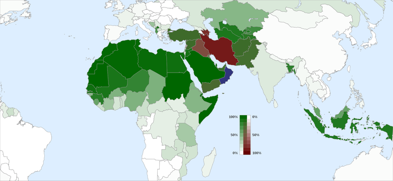

# Muslims

* 
* The countries where the Shia form a majority are Iran, Iraq, Azerbaijan, and Bahrain; all are coloured in red.

## Iran
* Iran is an Islamic republic. The Constitution of the Islamic Republic of Iran mandates that the official religion of Iran is Shia Islam and the Twelver Ja'fari school, though it also mandates that other Islamic schools are to be accorded full respect, and their followers are free to act in accordance with their own jurisprudence in performing their religious rites and recognizes Zoroastrian, Jewish, and Christian Iranians as religious minorities. 
* Sunni Muslims constitute approximately 9% of the Iranian population.

## Iraq
* Iraq is 97% Muslim: 60-67% Shi'a, 33-40% Sunni.

## Syria
* Islam in Syria comprises 87% of the total population.
* Sunnis make up 74% of the total, mostly of Arab, Kurdish and Turkish ethnicities.
* Shia's make up the remaining 13%

## Pakistan
* 97% of Pakistanis are Muslim
* the majority are Sunni, with an estimated 5–20% Shi'a.

## Bangladesh
* Muslims constitute 89.5% of the population
* most Muslims are Sunnis, but there is a small Shia community

## India
* half of Muslims live in India
* Indian Shiite Muslims form a substantial minority within the Muslim community of India comprising between 25%–31% of total Muslim population

## Saudi Arabia
* 97% of the total population are Muslism
* About 85–90% of Saudis are Sunni, while Shias represent around 10–15% of the Muslim population

## Indonesia
* The majority adheres to the Sunni Muslim tradition mainly of the Shafi'i madhhab
